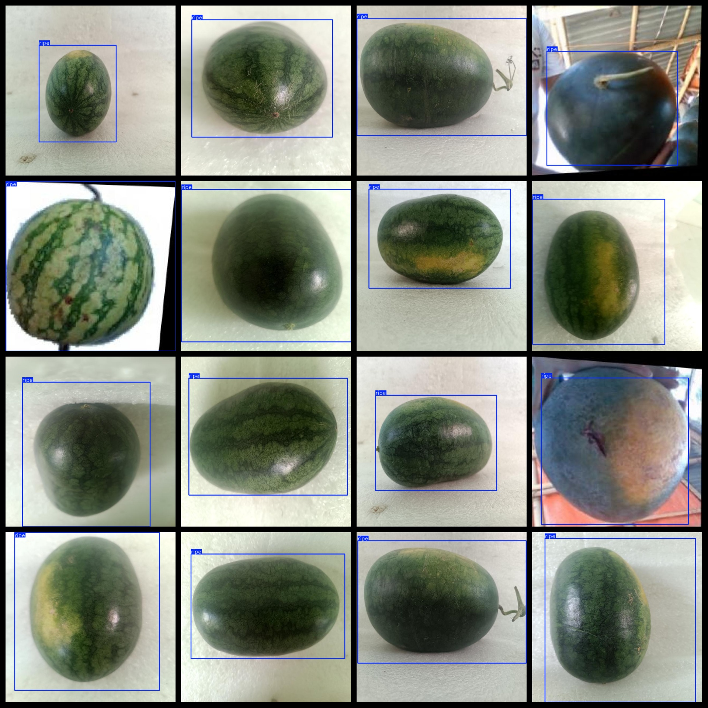

# Watermelon Ripeness Detection Dataset - 13350 Images in VOC+YOLO Format

The Watermelon Ripenness Detection Dataset consists of 13350 images, organized in VOC format plus YOLO format. The dataset includes three main folders: JPEGImages, Annotations, and labels. Each folder contains its respective types of files:

- JPEGImages folder contains a total of 13350 JPEG images.
- Annotations folder contains a total of 13350 XML files.
- labels folder contains a total of 13350 txt files.

There are two label categories: "ripe" and "unripe". For each category, there are 13392 frames (frames) for "ripe" and 806 frames for "unripe". The total number of frames is 14198.

The image resolution is clear, with a resolution of pixels. The images have been enhanced.

The GitHub repository location is datasets_sl.

The label shape is a rectangular box, used for target detection recognition.

Important Note: No 001 yet.

Special Declaration: This dataset does not guarantee the accuracy or precision of any trained models or weight files. The dataset only provides accurate and reasonable annotations.

The annotation and picture details are as follows:

## Images

---

Here is a pay link on Stripe (https://buy.stripe.com/3cs8yP7sY87d0vu9AB). Please contact me lonlonago@foxmail.com after funding $89, and I will send you a complete data files, thank you!

